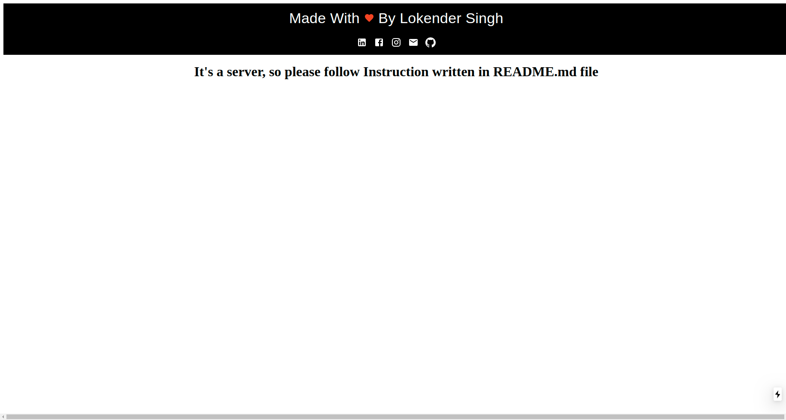
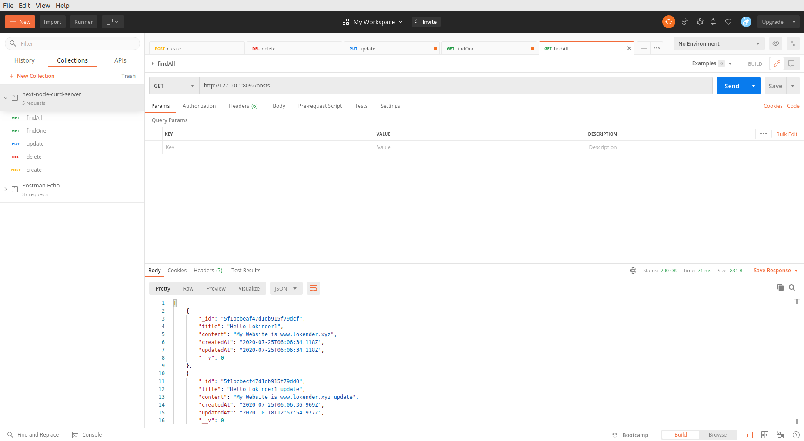

# NodeJS_NextJS_Backend_Server

```
It's a simple server thats made by using following technologies
- NodeJS
- NextJS

```

## How To Run 
```
    1. Install Packages
    yarn

    2. start server
    nodemon server/server.js

```

## Tasks Completed
1. Create Post
2. Update Post
3. Read Post
4. Delete Post
5. Read All Posts

## Demo ScreenShots
- Frontend HomePage


- PostMan API 
```
    Import following file in Postman to do CURD operations In Postman App
``` 
   
-   [ Postman CURD API File](next-node-curd-server.postman_collection.json)





